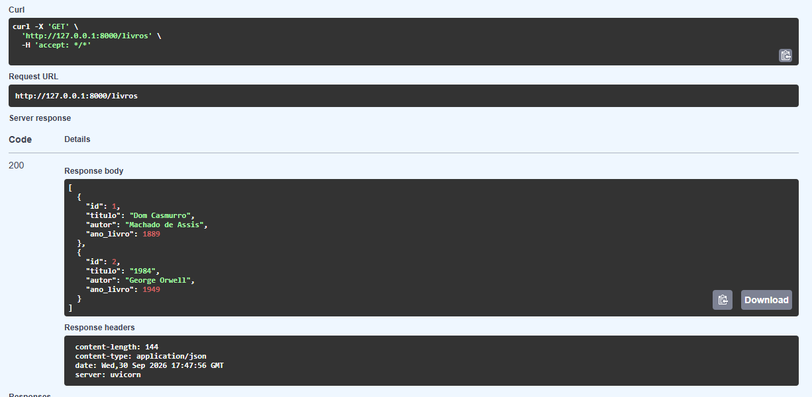
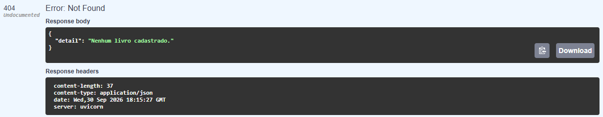
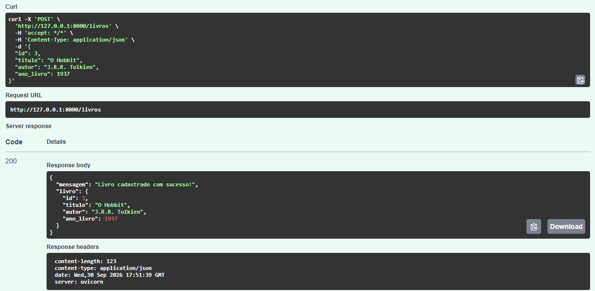
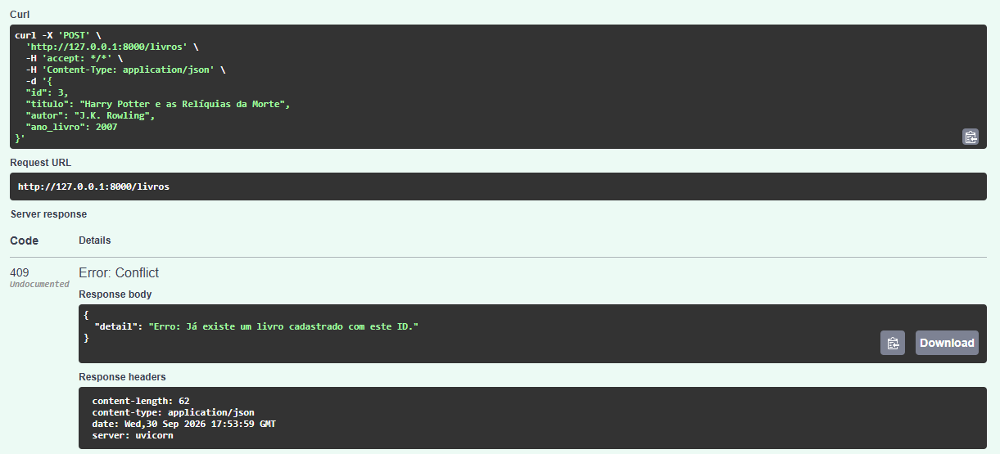
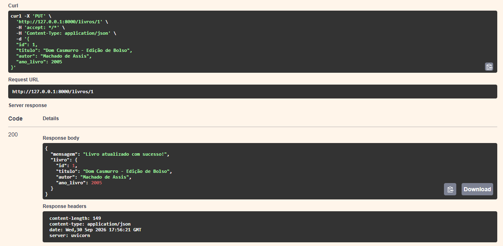
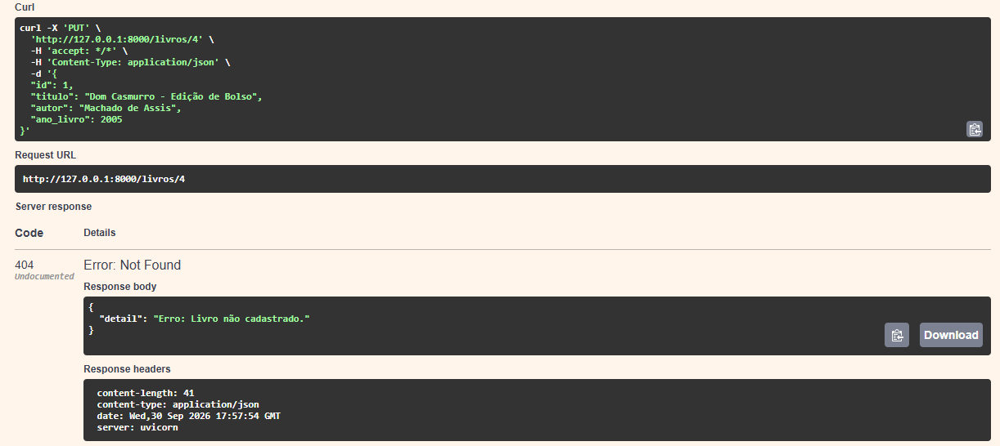
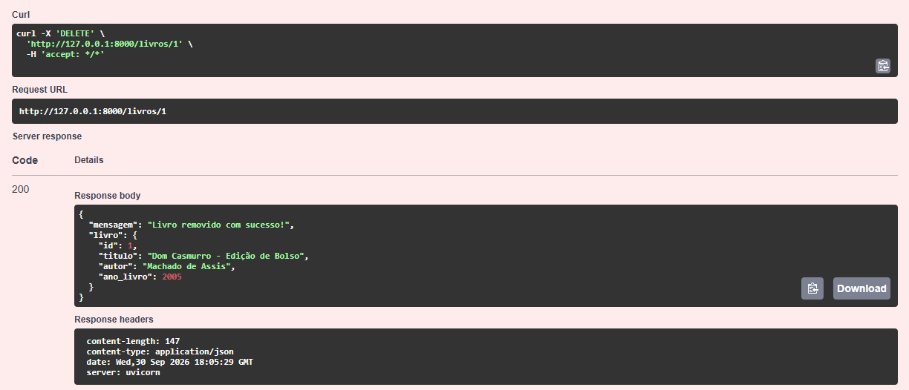
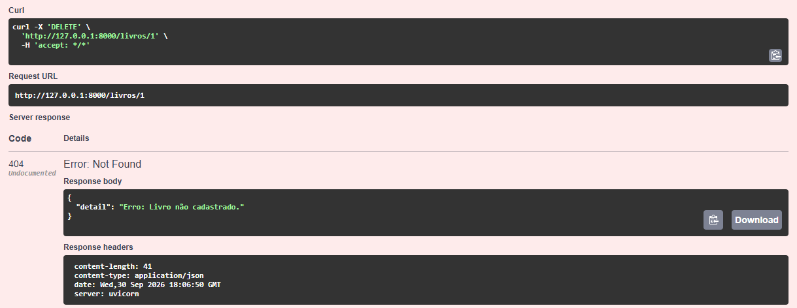

# API de Gerenciamento de Livros com FastAPI

## Descrição

Este projeto se trata de uma API REST assíncrona desenvolvida com FastAPI para gerenciamento de livros.

A aplicação implementa quatro métodos HTTP:

- GET;
- POST;
- PUT;
- DELETE.

Os dados são armazenados em memória, sem utilização de banco de dados.

Todos os endpoints foram implementados utilizando `async def` e operações assíncronas com `await`, tornando a API preparada para lidar com múltiplas requisições concorrentes.

## Tecnologias Utilizadas

- Python 3.14.6
- FastAPI
- Uvicorn
- Pydantic
- Poetry

## Instalação

### Passos para clonar e rodar

```bash
git clone https://github.com/tayanibritto/api-livros.git
```

```bash
cd api-livros
```

### Instalar dependências com Poetry

```bash
poetry install
```

### Ativar o ambiente virtual

```bash
poetry shell
```

### Executando a aplicação

```bash
poetry run uvicorn main:app --reload
```

### Digitar no navegador

```text
http://127.0.0.1:8000/docs
```

## Modelo de Dados

Livro:

```json
{
    "id": 1,
    "titulo": "Dom Casmurro",
    "autor": "Machado de Assis",
    "ano_livro": 1889  
}
```

Campos:

"id": int,
"titulo": "string",
"autor": "string",
"ano_livro": int  

## Endpoints

### GET /livros

Retorna todos os livros cadastrados. Resposta normal: 200.



Caso não tenha nenhum livro cadastrado: Erro 404.



### POST /livros

Cadastra um novo livro. Resposta normal: 200.



Caso o usuário tente cadastrar um livro em um ID já existente: Conflito 409.



### PUT /livros/{id}

Atualiza um livro existente. Resposta normal: 200.



Caso o usuário digite um ID inexistente: Erro 404.



### DELETE /livros/{id}

Remove um livro existente. Resposta normal: 200.



Caso o usuário digite um ID inexistente: Erro 404.



## Testes Realizados

Os testes foram realizados utilizando o Swagger UI do FastAPI, mas também funciona em aplicativos como Insomnia ou Postman.

### Cenários Testados

- GET retornando livros cadastrados;
- GET retornando erro 404 quando não existem livros;
- POST cadastrando novo livro;
- POST retornando erro 409 para ID já existente;
- PUT atualizando livro existente;
- PUT retornando erro 404 para ID inexistente;
- DELETE removendo livro existente;
- DELETE retornando erro 404 para ID inexistente.

## Estrutura do Projeto

```text
api-livros/
│
├── public/
│   ├── 200delete.png
│   ├── 200get.png
│   ├── 200post.png
│   ├── 200put.png
│   ├── 404delete.png
│   ├── 404get.png
│   ├── 404put.png
│   └── 409.png
│
├── main.py
├── README.md
├── pyproject.toml
├── poetry.lock
└── .gitignore
```


## Considerações

Este projeto foi desenvolvido com foco na utilização de:

- Endpoints assíncronos utilizando `async def`;
- Utilização de `await`;
- Modelagem de dados com Pydantic;
- Tratamento de exceções com HTTPException;
- Desenvolvimento de APIs REST utilizando FastAPI